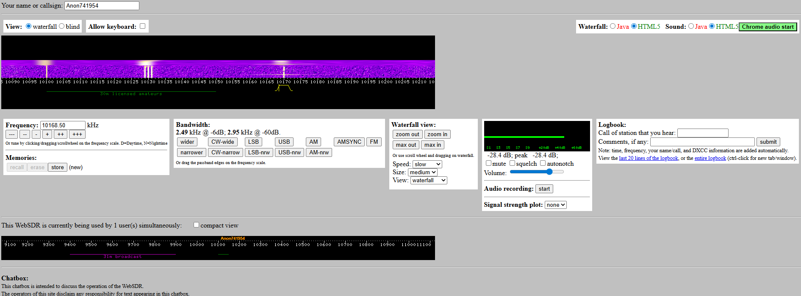

# VertexSDR



WebSDR-style server written from scratch in C. Browser-based waterfall and audio streaming for SDR receivers.

Built on the DSP and waterfall foundation originally written by PA3FWM for WebSDR, rewritten and extended as a new standalone project.

## Status

Beta. Needs testing, bug reports, and community work before it can be considered stable. Use at your own risk.

## Community

- Forum: https://forum.sdr-list.xyz/ (shared with PhantomSDR Plus, NovaSDR, and other SDR projects)
- GitHub: https://github.com/Steven9101/VertexSDR
- Bugs and issues: https://github.com/Steven9101/VertexSDR/issues
- Private contact: <magicint02@gmail.com>

## Support Development

If this is useful to you, donations help keep it going:

https://www.paypal.com/paypalme/magicint1337

## Quick Start (Debian / Ubuntu)

Fastest setup:

```bash
bash scripts/setup.sh
```

GPU/Vulkan setup:

```bash
bash scripts/setup.sh --vulkan
```

Then run:

```bash
./vertexsdr
```

Open http://localhost:8901 in a browser.

`scripts/setup.sh` installs dependencies, builds VertexSDR, and fetches the
frontend files for you.

The frontend is not built locally from this repo and is not shipped here.
Those files are copyright Pieter-Tjerk de Boer (PA3FWM), so the setup process
fetches them from third-party WebSDR operator repositories and patches them
locally. See [docs/frontend-setup.md](docs/frontend-setup.md).

## What It Does

- WebSDR-style browser receiver with live waterfall and audio
- ALSA, RTL-SDR (via rtl_tcp), TCP SDR relay, and stdin input
- FFTW CPU backend and Vulkan/VkFFT GPU backend
- AM, SSB, CW, FM demodulation with AM synchronous mode
- IQ balance correction, per-frequency EQ, noise blanker
- Multi-band, config reload, logbook, chatbox

## Building

All build variants produce `vertexsdr`:

```bash
make                                    # CPU only
make USE_VULKAN=1                       # GPU acceleration
```

The binary reads `websdr.cfg` from the current directory, or takes a path as argument:

```bash
./vertexsdr
./vertexsdr /etc/websdr.cfg
```

If you do not want to use the setup script, fetch the WebSDR frontend files before first run:

```bash
bash scripts/fetch-frontend.sh
```

This downloads the frontend from external WebSDR repositories instead of
shipping or rebuilding it in VertexSDR, because those files are not
redistributed here for copyright reasons.

## Configuration

Edit `websdr.cfg`. Key settings:

```
maxusers 100
tcpport 8901
fftbackend fftw
public pub2

band HF
device !rtlsdr 127.0.0.1:1234
samplerate 2048000
centerfreq 10100
gain 30
```

Device forms:
- ALSA: `device hw:0,0`
- RTL-SDR via rtl_tcp: `device !rtlsdr 127.0.0.1:1234`
- TCP SDR relay: `device !tcpsdr 127.0.0.1:1234`
- stdin: `device !stdin` with `stdinformat cu8` (or cs16le, f32le, etc.)

See docs/configuration.md for all options.

## RTL-SDR Example

Start rtl_tcp in one terminal:

```bash
rtl_tcp -a 127.0.0.1 -p 1234 -f 10100000 -s 2048000 -g 30
```

In websdr.cfg:

```
band HF
device !rtlsdr 127.0.0.1:1234
samplerate 2048000
centerfreq 10100
gain 30
```

Then run `./vertexsdr`.

## RTL-SDR via stdin (rx_tools)

Using rx_sdr from rx_tools to pipe samples directly:

```bash
rx_sdr -f 10100000 -s 2048000 -g 30 - | ./vertexsdr
```

In websdr.cfg:

```
band HF
device !stdin
stdinformat cu8
samplerate 2048000
centerfreq 10100
gain 30
```

## SDR List Registration

VertexSDR registers your server on both **websdr.org** and **sdr-list.xyz** automatically when configured. Each band is registered as a separate receiver with its own frequency range, and the sdr-list update path always rides alongside the WebSDR directory registration.

Add to websdr.cfg:

```
orgserver websdr.org
myhost your.hostname.com
hostname your.hostname.com
```

If your server is behind NAT or a reverse proxy, set `hostname` to the public address. Both directories receive the same multi-receiver data.

## Hardware Notes

RX888 works well with the Vulkan/VkFFT path for wideband use. Not all sample rates are validated. See docs/sample-rates-and-hardware.md before trying unusual rates.

## Tested Configurations

- RTL-SDR via rtl_tcp at 2.048 MHz (cu8 IQ) - working
- stdin at 2.048 MHz (cu8/cs16le IQ) - working

## Documentation

- [Installation and Build](docs/installation.md)
- [Configuration Reference](docs/configuration.md)
- [Sample Rates and Hardware](docs/sample-rates-and-hardware.md)
- [Operations and Deployment](docs/operations.md)
- [Band Switching](docs/band-switching.md)
- [Raspberry Pi / ARM](docs/raspberry-pi.md)
- [stdin Pipelines](docs/stdin-pipelines.md)

## Contributing

Bug reports, testing on real hardware, DSP fixes, documentation, and UI work are all needed. Open an issue or PR on GitHub.

## About

VertexSDR is original code. Not a port, fork, decompilation, or reuse of the WebSDR codebase. Written from scratch using the SDR and DSP knowledge built up through PhantomSDR Plus and NovaSDR.

## License

LGPL 3.0. See COPYING.
